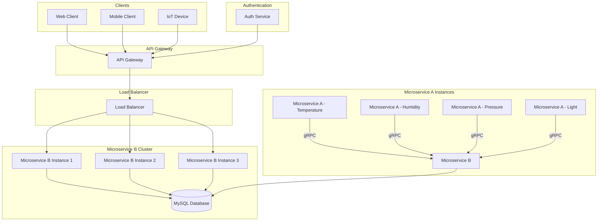

```mermaid
graph TD
    subgraph "Microservice A Instances"
        A1[Microservice A - Temperature] --> |gRPC| B
        A2[Microservice A - Humidity] --> |gRPC| B
        A3[Microservice A - Pressure] --> |gRPC| B
        A4[Microservice A - Light] --> |gRPC| B
    end

    subgraph "Load Balancer"
        LB[Load Balancer]
    end

    subgraph "Microservice B Cluster"
        LB --> B1[Microservice B Instance 1]
        LB --> B2[Microservice B Instance 2]
        LB --> B3[Microservice B Instance 3]
        B1 --> DB
        B2 --> DB
        B3 --> DB
        B[Microservice B] --> DB[(MySQL Database)]
    end

    subgraph "API Gateway"
        API[API Gateway] --> LB
    end

    subgraph "Clients"
        C1[Web Client] --> API
        C2[Mobile Client] --> API
        C3[IoT Device] --> API
    end

    subgraph "Authentication"
        Auth[Auth Service] --> API
    end
```