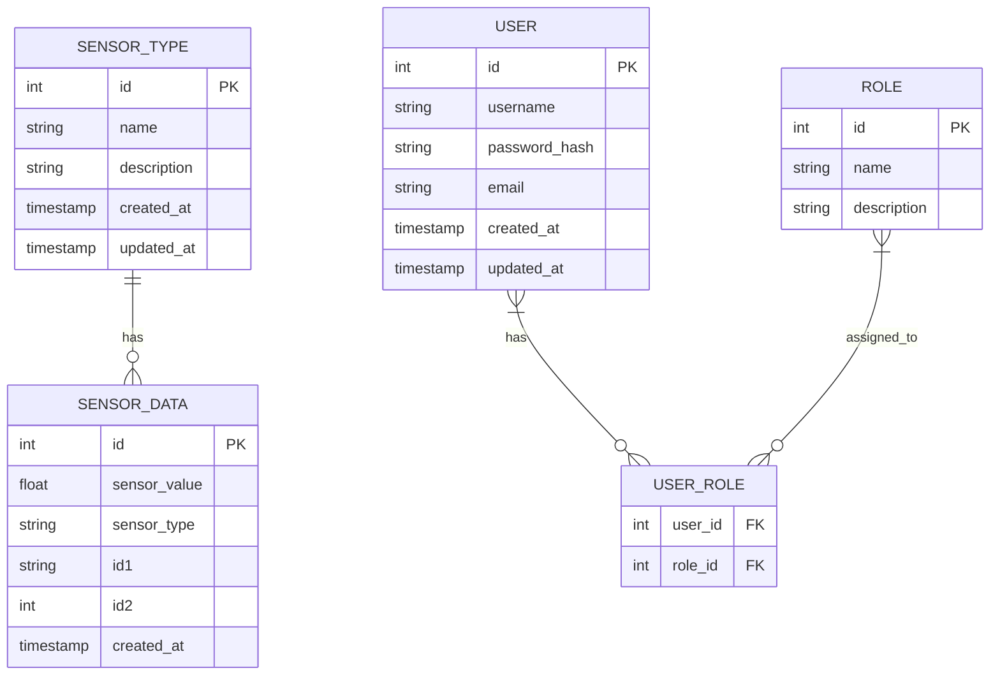

```mermaid
erDiagram
    SENSOR_DATA {
        int id PK
        float sensor_value
        string sensor_type
        string id1
        int id2
        timestamp created_at
    }

    SENSOR_TYPE {
        int id PK
        string name
        string description
        timestamp created_at
        timestamp updated_at
    }

    USER {
        int id PK
        string username
        string password_hash
        string email
        timestamp created_at
        timestamp updated_at
    }

    ROLE {
        int id PK
        string name
        string description
    }

    USER_ROLE {
        int user_id FK
        int role_id FK
    }

    SENSOR_TYPE ||--o{ SENSOR_DATA : "has"
    USER }|--o{ USER_ROLE : "has"
    ROLE }|--o{ USER_ROLE : "assigned_to"
```
